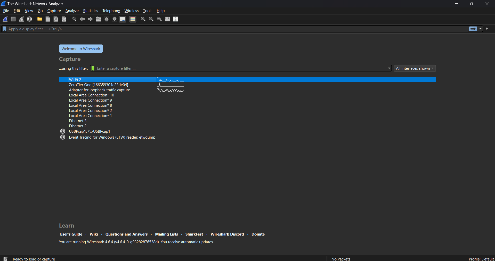
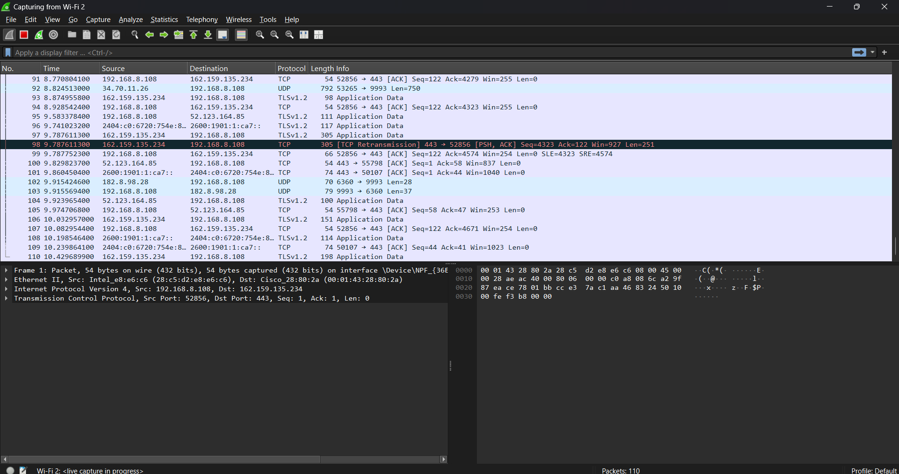
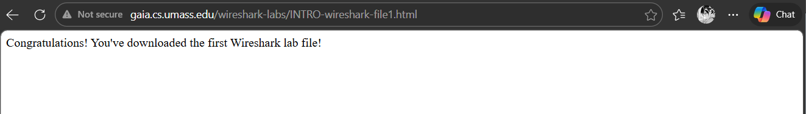
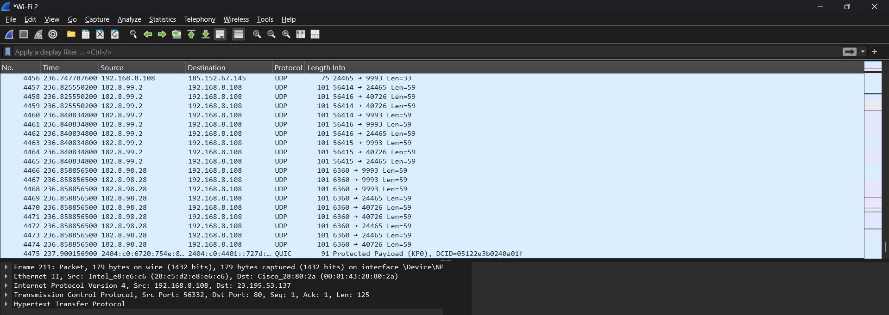
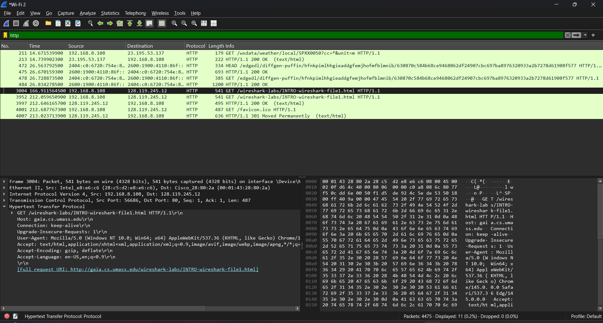
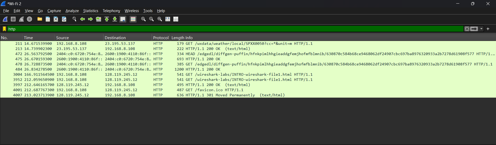

NAMA: RIYAN CHANDRA SAPUTRA
NIM: 103072400129
KELAS: IF-04-02

LAPORAN HASIL PRAKTIKUM JARINGAN KOMPUTER MODUL 2

LANGKAH LANGKAH PRAKTIKUM:

1.	Menjalankan aplikasi Wireshark, dengan membuka wireshark akan memunculkan tampilan seperti dibawah ini. Lalu kita memilih menu capture pada interface jaringan yang aktif, contoh dibawah ini kita memilih WI-FI 2.

2.	Setelah memilih menu capture sebelumnya, kita akan melihat proses capture dimulai. Wireshark mulai merekam semua paket yang dikirim dan diterima oleh computer seperti dibawah ini.

3.	Setelah itu kita memulai mengakses halaman berikut:
http://gaia.cs.umass.edu/wireshark-labs/INTRO-wireshark-file1.html

Saat halaman diakses, browser mengirim permintaan HTTP ke server dan server mengirim balasan. Semua proses ini ditangkap oleh Wireshark.

4.	Setelah halaman berhasil di akses, proses capture dihentikan. Wireshark menampilkan daftar semua paket yang sudah direkam selama proses berlangsung.

5.	Banyaknya paket muncul karena berbagai proses jaringan berjalan bersamaan. Karena kita difokuskan untuk mencari HTTP, kita bisa menggunakan fitur pencarian untuk mencari “http”. Setelah itu akan menampilkan hanya paket HTTP seperti gambar dibawah ini.

6.	Dengan mengakses halaman pada Langkah Langkah di nomor 3 tadi, kita mendapatkan  paket HTTP yang dimana isinya:
Source: 192.168.8.108
Destination: 128.119.245.12
Protocol: HTTP
Info: GET /wireshark-labs/INTRO-wiresharfk-file1.html HTTP/1.1

Ini menunjukkan browser mengirim permintaan HTTP GET untuk mengambil halaman web dari server gaia.cs.umass.edu.

