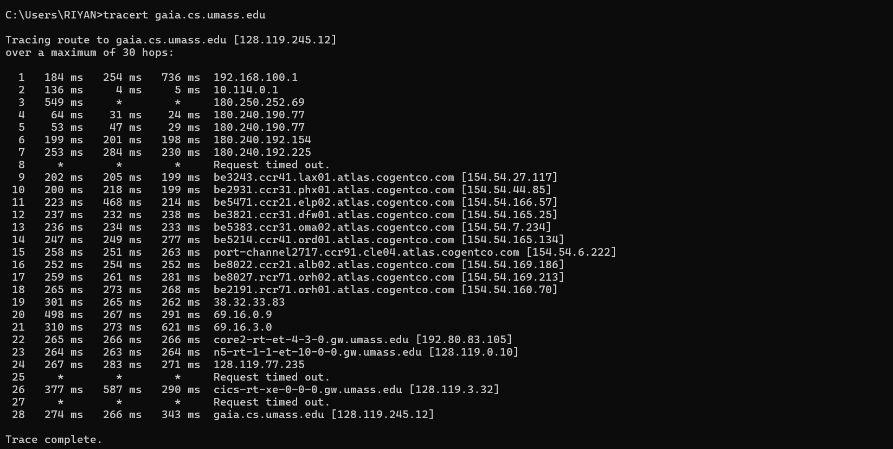
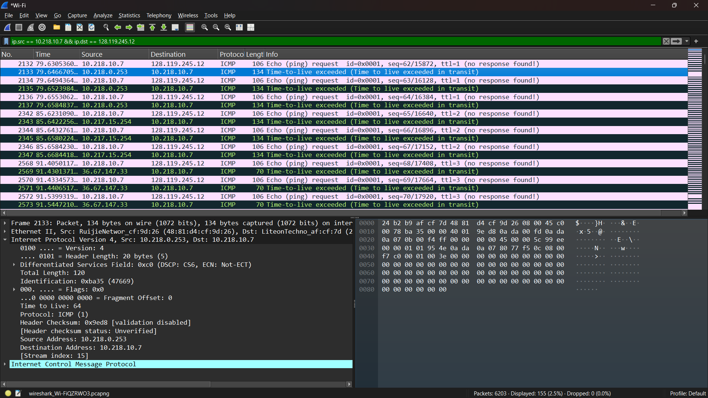
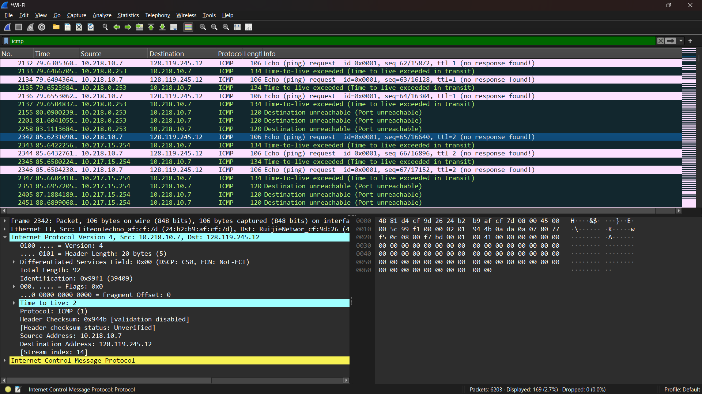
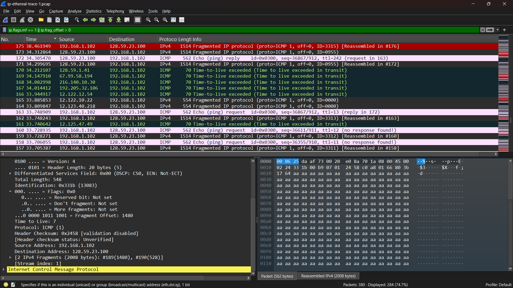
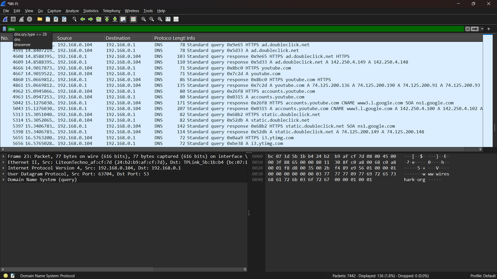

NAMA: RIYAN CHANDRA SAPUTRA

NIM: 103072400129

KELAS: IF-04-02

LAPORAN PRAKTIKUM WEEK 10

## Menangkap paket dari traceroute

## IPV4 Dasar
## TTL 1:

## TTL 2:

## Fregmentasi

Pada hasil analisis ditemukan fragmentasi IP. Hal ini ditunjukkan oleh adanya paket dengan nilai Fragment Offset lebih dari 0, yaitu sebesar 1480. Selain itu, nilai More Fragments (MF) pada paket tersebut adalah 0, yang menunjukkan bahwa paket tersebut merupakan fragment terakhir. Fragmentasi terjadi karena datagram yang dikirim melebihi ukuran Maximum Transmission Unit (MTU), sehingga dipecah menjadi beberapa bagian. Hal ini diperkuat dengan adanya beberapa paket yang memiliki nilai Identification yang sama.

## IPV6
Berdasarkan hasil analisis menggunakan Wireshark, ditemukan paket DNS yang berisi permintaan tipe A (IPv4), seperti pada domain youtube.com dan doubleclick.net. Namun, tidak ditemukan paket DNS dengan tipe AAAA (IPv6). Hal ini menunjukkan bahwa pada saat proses capture dilakukan, sistem hanya melakukan resolusi alamat IPv4 dan tidak melakukan permintaan alamat IPv6. Kemungkinan hal ini disebabkan oleh konfigurasi jaringan atau DNS server yang tidak mengutamakan penggunaan IPv6.

