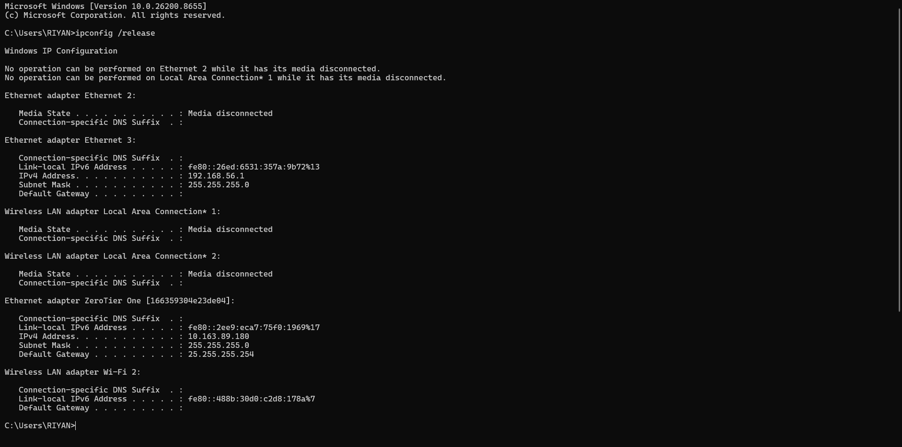
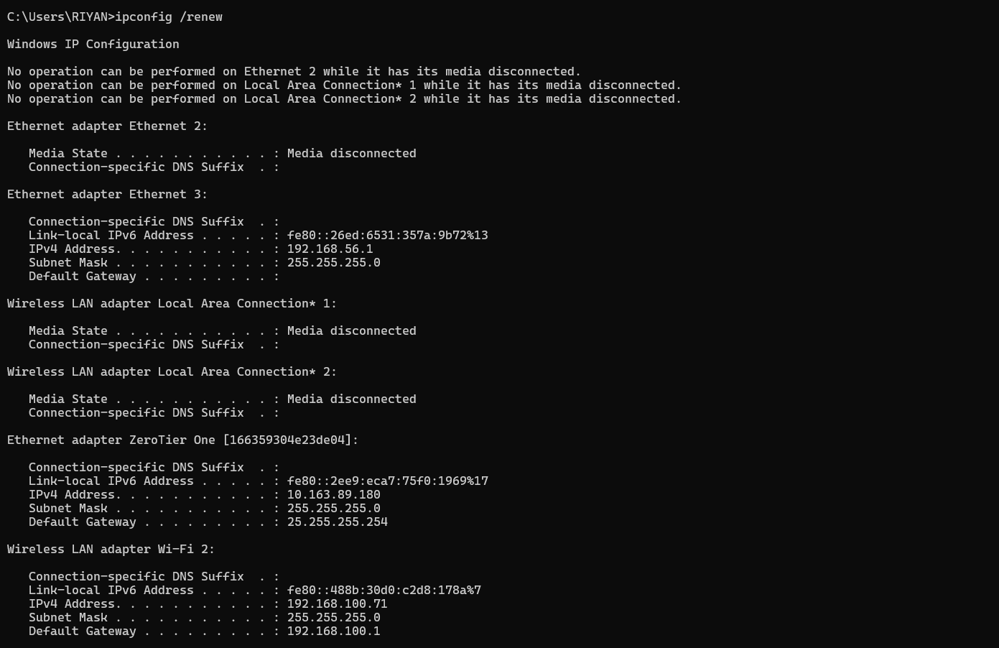
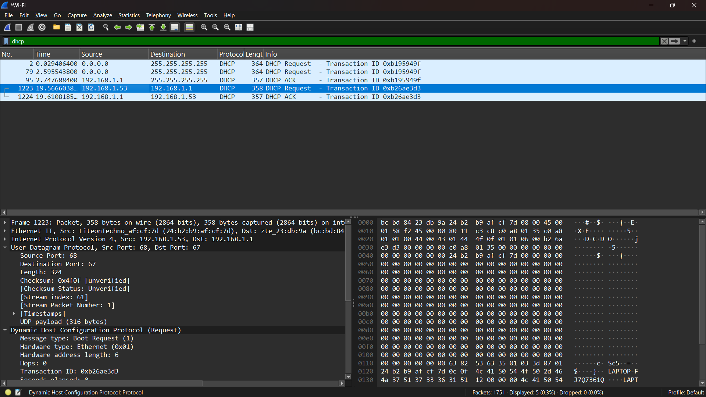

NAMA: RIYAN CHANDRA SAPUTRA

NIM: 103072400129

KELAS: IF-04-02

LAPORAN PRAKTIKUM WEEK 11

1. IPCONFIG/RELEASE

2. IPCONFIG/RENEW

3. DHCP REQUEST

4. DHCP ACK

Pada percobaan DHCP di Windows, paket yang tertangkap hanya DHCP Request dan DHCP ACK. Hal ini terjadi karena sistem masih memiliki lease IP sebelumnya sehingga proses DHCP berlangsung dalam mode renewal, bukan initial discovery penuh