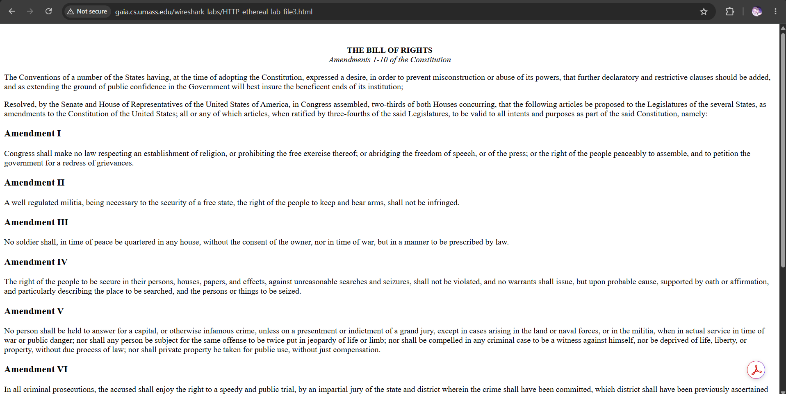
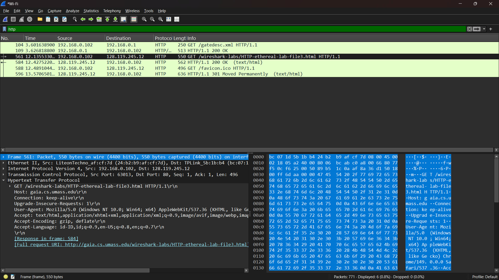
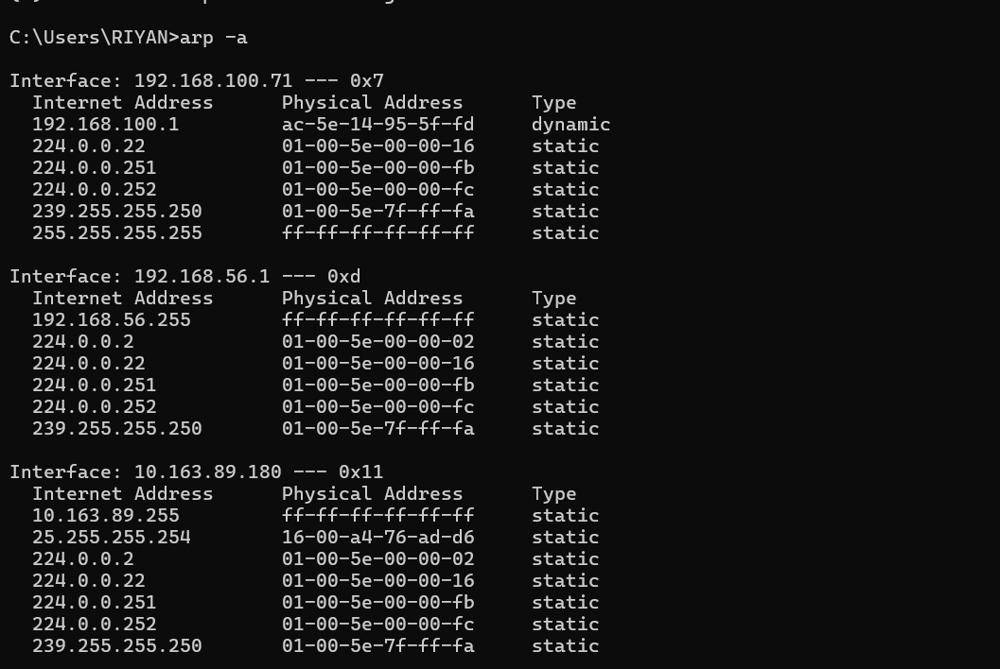

NAMA: RIYAN CHANDRA SAPUTRA

NIM: 103072400129

KELAS: IF-04-02

LAPORAN PRAKTIKUM WEEK 13

## Menangkap dan menganalisis frame Ethernet 

1. Buka URL http://gaia.cs.umass.edu/wireshark-labs/HTTP-ethereal-lab-file3.html di browser

2. Filter http di wireshark setelah buka URL sebelumnya

## Caching ARP 

1. Di CMD ketik arp -a

2. Paket arp di wireshark

