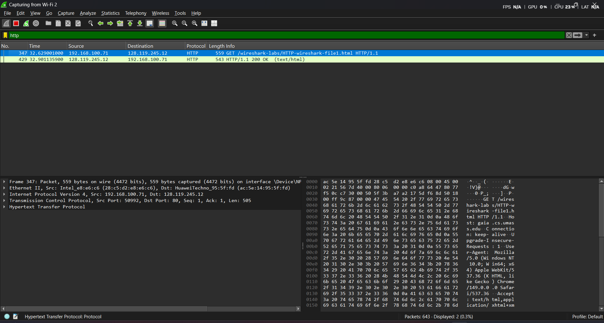
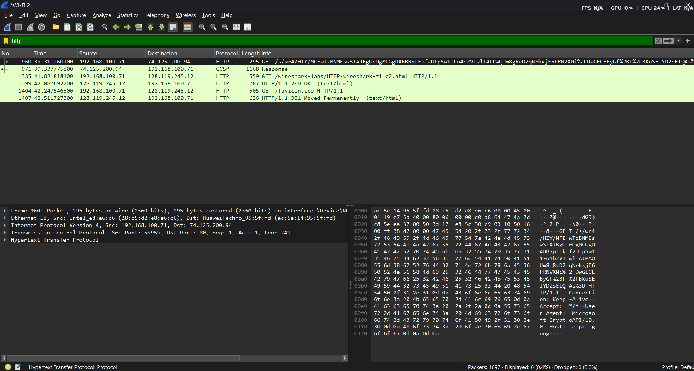
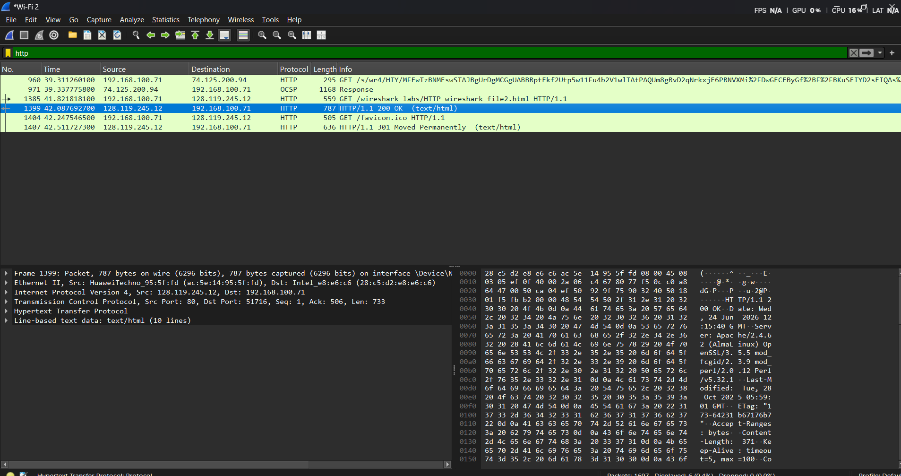
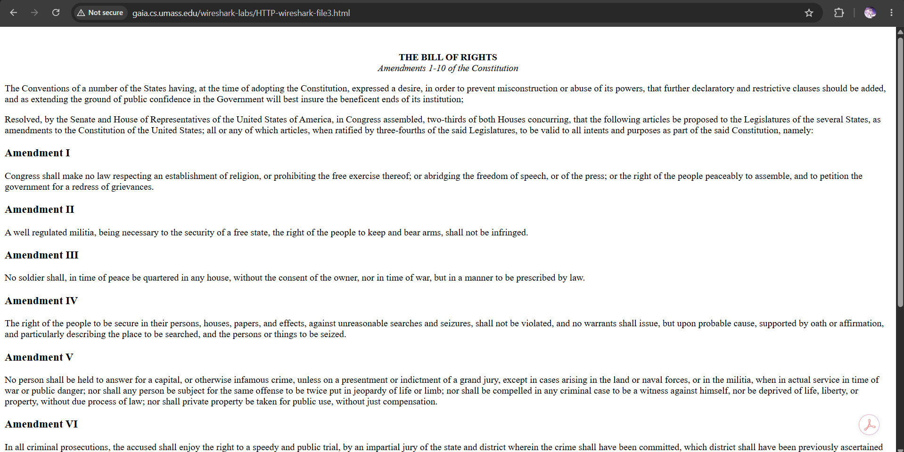
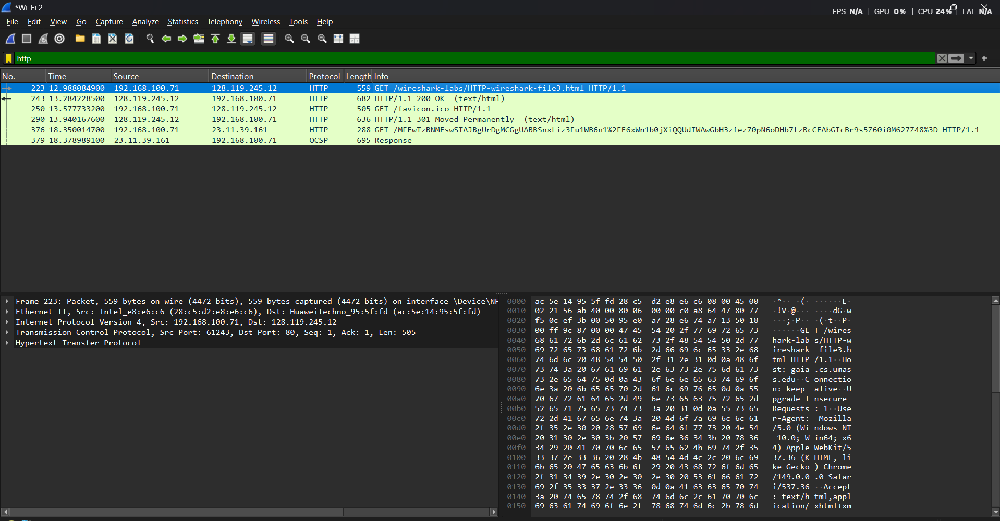
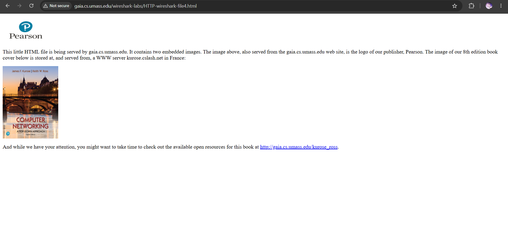
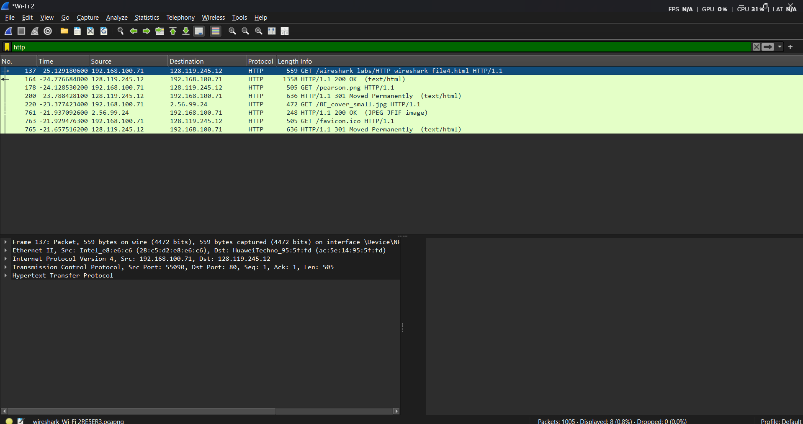
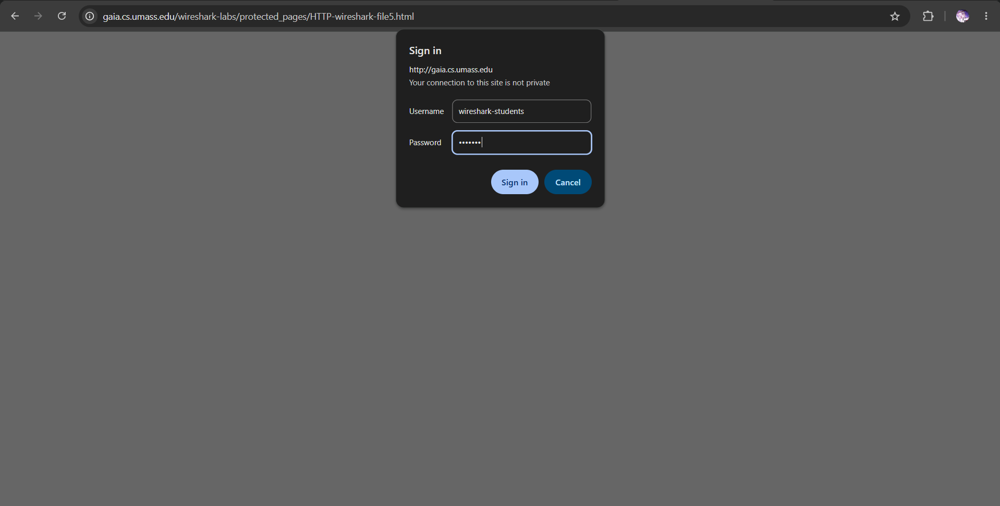
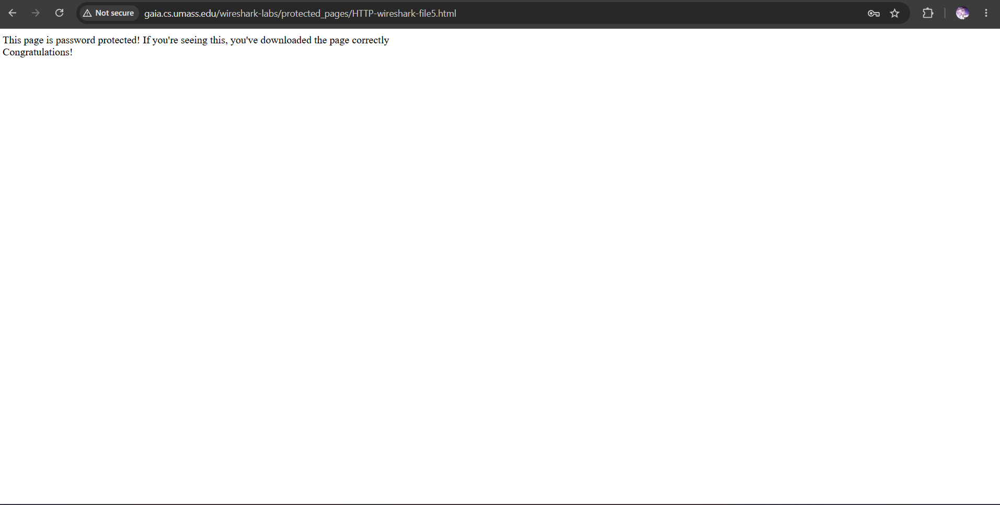
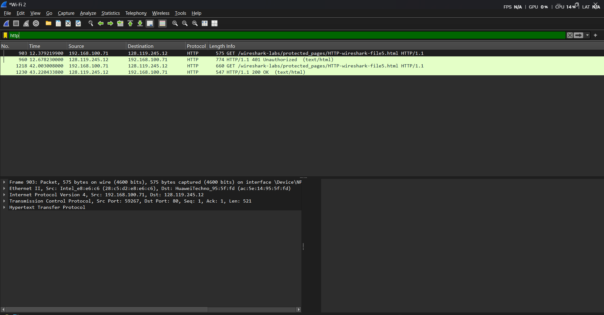

NAMA: RIYAN CHANDRA SAPUTRA

NIM: 103072400129

KELAS: IF-04-02

LAPORAN HASIL PRAKTIKUM MODUL 3
LANGKAH LANGKAH PRAKTIKUM:

# 1. Basic HTTP GET/response interaction

1. Mulai tangkap paket dengan wireshark dan menggunakan filter search dengan mengetik http

2. Buka browser dan jalankan link berikut http://gaia.cs.umass.edu/wireshark-labs/HTTP-wireshark-file1.html

3. Setelah itu akan menampilkan hasil dari http di dalam wireshark dan hentikan penangkapan paketnya

# 2. HTTP CONDITIONAL GET/response interaction

1. Mulai tangkap paket dengan wireshark

2. Masukkan http://gaia.cs.umass.edu/wireshark-labs/HTTP-wireshark-file2.html di browser

3. Hentikan pengampilan paket, dan masukkan http di searchbar wireshark

4. Dan muncul hasil ujicoba tadi yang di line ke 3 dan 4 dari gambar dibawah ini

# 3. Retrieving Long Documents

1. Mulai tangkap paket dengan wireshark

2. Masukkan http://gaia.cs.umass.edu/wireshark-labs/HTTP-wireshark-file3.html di browser dan akan menghasilkan dibawah ini

3. Hentikan pengambilan paket, dan masukkan filter http di searchbar wireshark dan hasilnya ini

# 4. HTML Documents dengan Embedded Objects

1. Mulai tangkap paket dengan wireshark

2. Masukkan http://gaia.cs.umass.edu/wireshark-labs/HTTP-wireshark-file4.html di browser dan akan menghasilkan dibawah ini

3. Hentikan pengambilan paket, dan masukkan filter http di searchbar wireshark dan hasilnya ini

# 5. HTTP Authentication 

1. Masukkan URL http://gaia.cs.umass.edu/wireshark-labs/protected_pages/HTTP-wireshark-file5.html

2. Mulai tangkap paket di wireshark

3. URL yang tadi akan menampilkan ini

4. Hentikan penangkapan paket dan pake filter http

