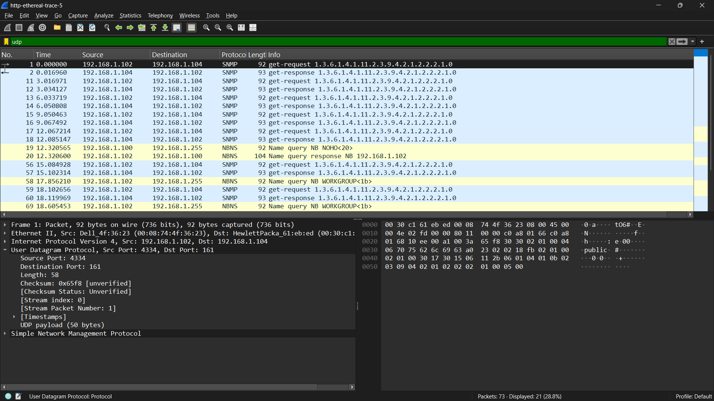
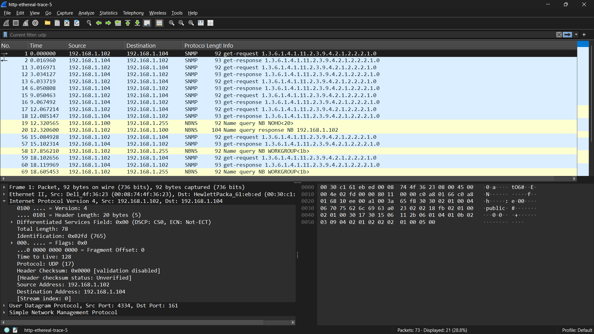
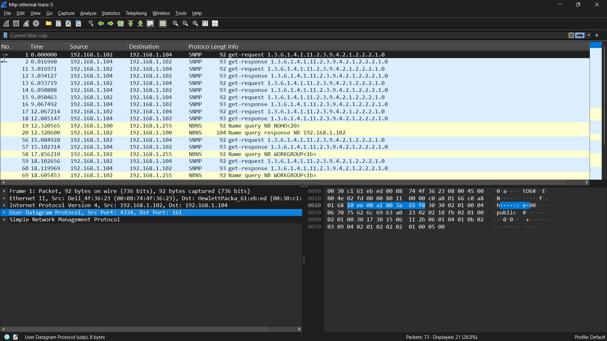
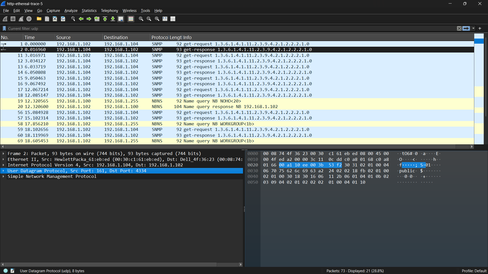

NAMA: RIYAN CHANDRA SAPUTRA

NIM: 103072400129

KELAS: IF-04-02

LAPORAN HASIL PRAKTIKUM MODUL 5

1. Pilih satu paket UDP yang terdapat pada trace Anda. Dari paket tersebut, berapa banyak “field” yang terdapat pada header UDP?Sebutkan nama-nama field yang Anda temukan! 
Jawab : Terdapat 4 field pada header UDP, yaitu:Source Port, Destination Port,Length, Checksum

2. Perhatikan informasi “content field” pada paket yang Anda pilih di pertanyaan 1. Berapa panjang (dalam satuan byte) masing-masing “field” yang terdapat pada header UDP? Jawab : Setiap field pada header UDP memiliki panjang 2 byte, sehingga total panjang header UDP adalah 8 byte.

3. Nilai yang tertera pada ”Length” menyatakan nilai apa? Verfikasi jawaban Anda melalui paket UDP pada trace. 
Jawab : Berdasarkan hasil analisis pada Wireshark, nilai Length menunjukkan total panjang paket UDP yang mencakup header dan payload. Misalnya, jika nilai Length adalah 58 byte, maka 8 byte merupakan header UDP dan sisanya merupakan data. Hal ini membuktikan bahwa field Length menyatakan total ukuran segmen UDP. ( 58 - 8 = 50)

4. Berapa jumlah maksimum byte yang dapat disertakan dalam payload UDP? (Petunjuk: jawaban untuk pertanyaan ini dapat ditentukan dari jawaban Anda untuk pertanyaan 2)
Jawab : Field Length pada UDP memiliki ukuran 2 byte sehingga nilai maksimumnya adalah 65535 byte. Karena header UDP memiliki panjang tetap sebesar 8 byte, maka maksimum payload yang dapat dikirim adalah 65535 dikurangi 8, yaitu sebesar 65527 byte.

5. Berapa nomor port terbesar yang dapat menjadi port sumber? (Petunjuk: lihat petunjuk pada pertanyaan 4) 
Jawab : 2^16 - 1 = 65535. Nomor port terbesar adalah 65535.

6. Berapa nomor protokol untuk UDP? Berikan jawaban Anda dalam notasi heksadesimal dan desimal. Untuk menjawab pertanyaan ini, Anda harus melihat ke bagian ”Protocol” pada datagram IP yang mengandung segmen UDP.
Jawab : Nomor protokol UDP adalah: Desimal: 17, Heksadesimal: 0x11

7. Periksa pasangan paket UDP di mana host Anda mengirimkan paket UDP pertama dan paket UDP kedua merupakan balasan dari paket UDP yang pertama. (Petunjuk: agar paket kedua merupakan balasan dari paket pertama, pengirim paket pertama harus menjadi tujuan dari paket kedua). Jelaskan hubungan antara nomor port pada kedua paket tersebut!
Jawab : Pada paket balasan, nomor port sumber dan tujuan saling bertukar dibandingkan dengan paket permintaan. Hal ini menunjukkan bahwa balasan dikirim kembali ke port asal pengirim.

