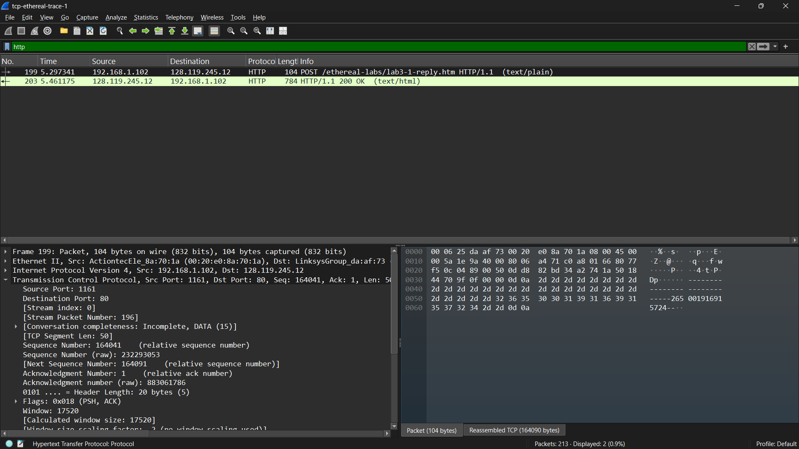
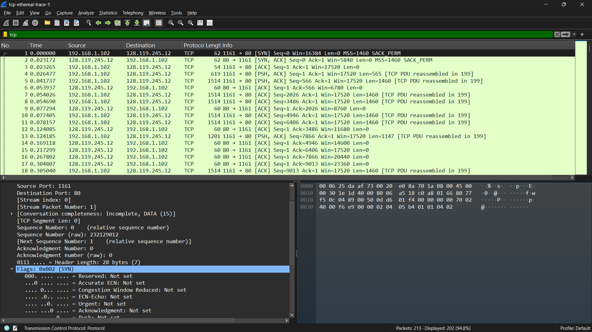
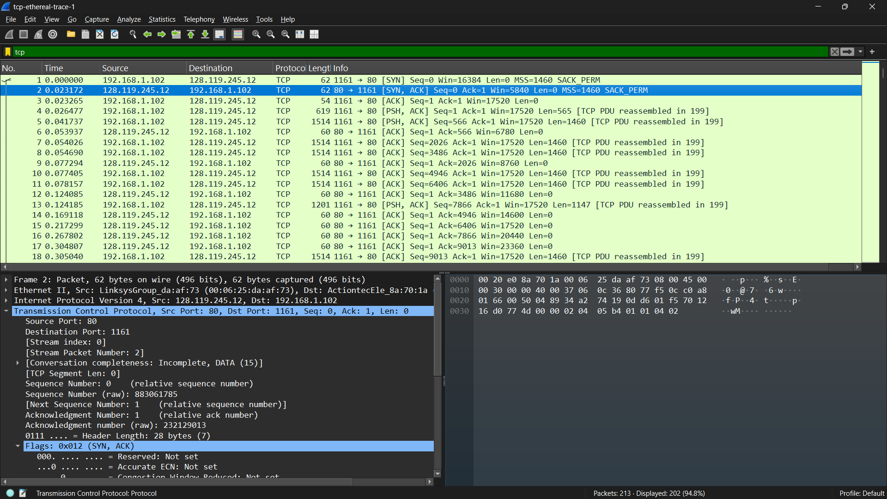
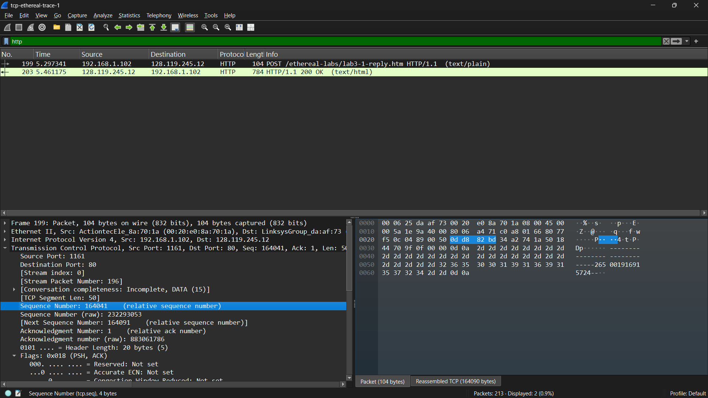
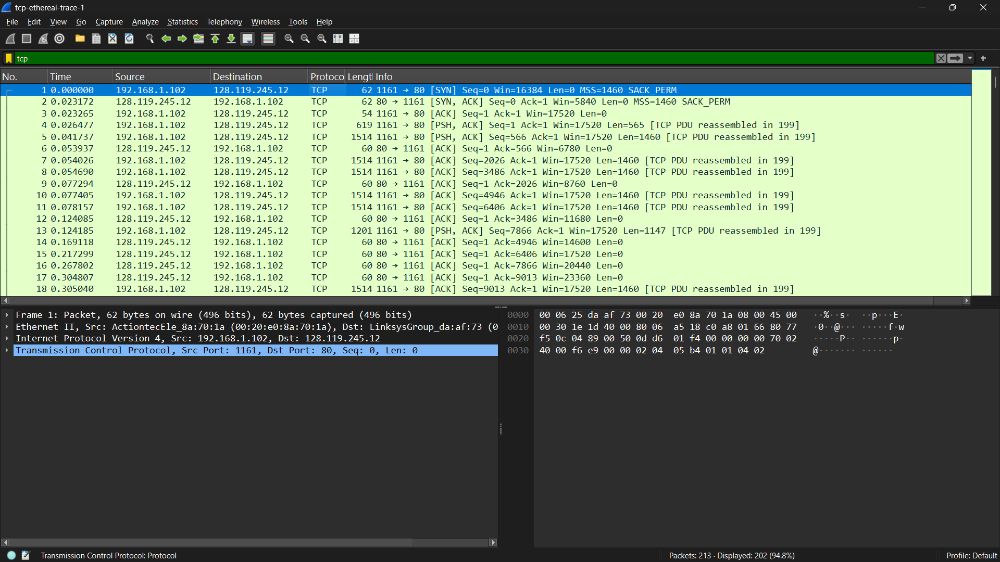
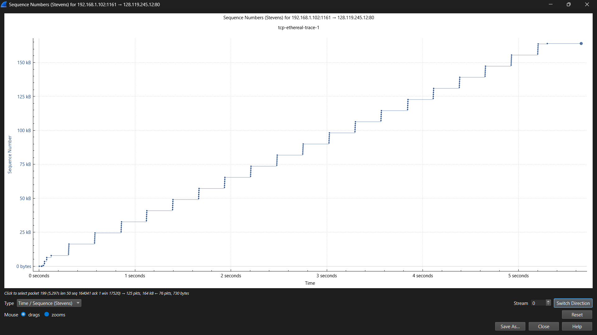

NAMA: RIYAN CHANDRA SAPUTRA

NIM: 103072400129

KELAS: IF-04-02

LAPORAN HASIL PRAKTIKUM MODUL 6

# Tampilan Awal pada Captured Trace 

1. Berapa alamat IP dan nomor port TCP yang digunakan oleh komputer klien (sumber) untuk mentransfer file ke gaia.cs.umass.edu? Cara paling mudah menjawab pertanyaan ini adalah dengan memilih sebuah pesan HTTP dan meneliti detail paket TCP yang digunakan untuk membawa pesan HTTP tersebut.
Jawab :

2. Apa alamat IP dari gaia.cs.umass.edu? Pada nomor port berapa ia mengirim dan menerima segmen TCP untuk koneksi ini?
Jawab : Berdasarkan analisis paket TCP pada Wireshark, alamat IP dari gaia.cs.umass.edu adalah 128.119.245.12. Server menggunakan port 80 (HTTP) untuk mengirim dan menerima segmen TCP dalam koneksi tersebut.

3. Berapa alamat IP dan nomor port TCP yang digunakan oleh komputer klien Anda (sumber) untuk mentransfer ke gaia.cs.umass.edu?
Jawab : Berdasarkan analisis paket TCP pada Wireshark, alamat IP komputer klien adalah 192.168.1.102 dengan nomor port TCP 1161. Informasi ini diperoleh dari field Source pada protokol IP dan TCP.

# Dasar TCP

1. Berapa nomor urut segmen TCP SYN yang digunakan untuk memulai sambungan TCP antara komputer klien dan gaia.cs.umass.edu? Apa yang dimiliki segmen tersebut sehingga teridentifikasi sebagai segmen SYN?
Jawab : Nomor urut segmen SYN adalah 0. Segmen ini teridentifikasi sebagai SYN karena memiliki flag SYN.

2. Berapa nomor urut segmen SYNACK yang dikirim oleh gaia.cs.umass.edu ke komputer klien sebagai balasan dari SYN? Berapa nilai dari field Acknowledgement pada segmen SYNACK? Bagaimana gaia.cs.umass.edu menentukan nilai tersebut? Apa yang dimiliki oleh segmen sehingga teridentifikasi sebagai segmen SYNACK?
Jawab : Nomor urut SYN-ACK adalah 0 dan nilai acknowledgement adalah 1. Nilai ini diperoleh dari sequence number SYN sebelumnya ditambah 1. Segmen ini teridentifikasi karena memiliki flag SYN dan ACK.

3. Berapa nomor urut segmen TCP yang berisi perintah HTTP POST? Perhatikan bahwa untuk menemukan perintah POST, Anda harus menelusuri content field milik paket di bagian bawah jendela Wireshark, kemudian cari segmen yang berisi "POST" di bagian field DATA nya.
Jawab : 164401

4. Anggap segmen TCP yang berisi HTTP POST sebagai segmen pertama dalam koneksi TCP. Berapa nomor urut dari enam segmen pertama dalam TCP (termasuk segmen yang berisi HTTP POST)? Pada jam berapa setiap segmen dikirim? Kapan ACK untuk setiap segmen diterima? Dengan adanya perbedaan antara kapan setiap segmen TCP dikirim dan kapan acknowledgement-nya diterima, berapakah nilai RTT untuk keenam segmen tersebut? Berapa nilai EstimatedRTT setelah penerimaan setiap ACK? (Catatan: Wireshark memiliki fitur yang memungkinkan Anda untuk memplot RTT untuk setiap segmen TCP yang dikirim. Pilih segmen TCP yang dikirim dari klien ke server gaia.cs.umass.edu pada jendela "daftarpaket yang ditangkap". Kemudian pilih: Statistics->TCP Stream Graph- >Round Trip Time Graph).
Jawab : RTT dihitung dari selisih waktu antara pengiriman segmen dan penerimaan acknowledgement. Nilai EstimatedRTT diperoleh dari grafik RTT pada Wireshark.

5. Berapa panjang setiap enam segmen TCP pertama? Jawab : 50

6. Berapa jumlah minimum ruang buffer tersedia yang disarankan kepada penerima dan diterima untuk seluruh trace? Apakah kurangnya ruang buffer penerima pernah menghambat pengiriman? 
Jawab : Nilai window size menunjukkan ruang buffer penerima. Jika nilainya besar dan stabil, maka tidak terjadi hambatan pengiriman.

7. Apakah ada segmen yang ditransmisikan ulang dalam file trace? Apa yang anda periksa (di dalam file trace) untuk menjawab pertanyaan ini? 
Jawab : Tidak terdapat retransmission jika tidak ditemukan paket dengan label TCP Retransmission.

8. Berapa banyak data yang biasanya diakui oleh penerima dalam ACK? Dapatkah anda mengidentifikasi kasus-kasus di mana penerima melakukan ACK untuk setiap segmen yang diterima?
Jawab : 1

9. Berapa throughput (byte yang ditransfer per satuan waktu) untuk sambungan TCP? Jelaskan bagaimana Anda menghitung nilai ini.
Jawab : Throughput = total data / waktu dan Throughput dihitung dengan membagi total byte yang ditransfer dengan waktu transfer.

# Congestion Control pada TCP

1. Gunakan alat plotting Time-Sequence-Graph (Stevens) untuk melihat grafik nomor urut berbanding waktu dari segmen yang dikirim oleh klien ke server gaia.cs.umass.edu. Dapatkah Anda mengidentifikasi di mana fase “slow start” TCP dimulai dan berakhir, dan pada bagian mana algoritma ”congestion avoidance” mengambil alih? Berikan komentar tentang bagaimana data yang diukur berbeda dari perilaku ideal TCP yang telah kita pelajari.
Jawab : Berdasarkan grafik Time-Sequence Graph (Stevens), fase slow start terjadi pada awal koneksi, ditandai dengan kenaikan sequence number yang sangat cepat (curam). Hal ini menunjukkan bahwa TCP meningkatkan laju pengiriman secara eksponensial. Setelah beberapa waktu, grafik mulai meningkat secara lebih landai. Fase ini disebut congestion avoidance, di mana TCP meningkatkan laju pengiriman secara linear untuk menghindari kemacetan jaringan.
2. Jawablah kedua pertanyaan di atas untuk trace yang Anda dapatkan ketika Anda mengirimkan file dari komputer ke gaia.cs.umass.edu.
Jawab : Berdasarkan grafik, terlihat bahwa TCP secara dinamis menyesuaikan laju pengiriman data. Pada awal koneksi, TCP menggunakan mekanisme slow start untuk meningkatkan throughput secara cepat, kemudian beralih ke congestion avoidance untuk menjaga stabilitas jaringan. Hal ini menunjukkan bahwa TCP pada kondisi nyata mempertimbangkan faktor seperti delay dan kapasitas jaringan, berbeda dengan model TCP ideal yang tidak mempertimbangkan kondisi tersebut.

